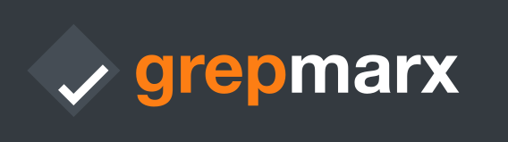
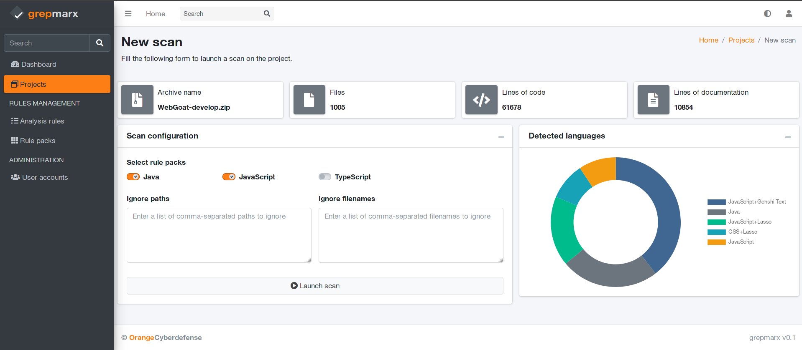
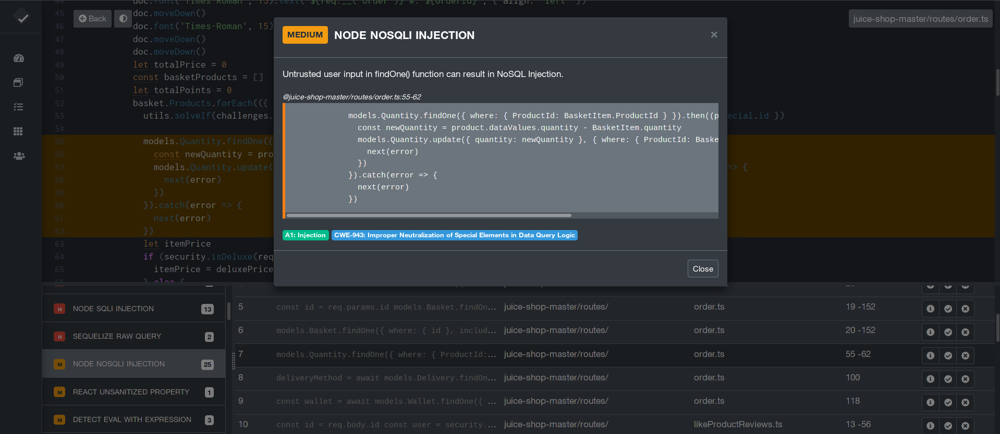
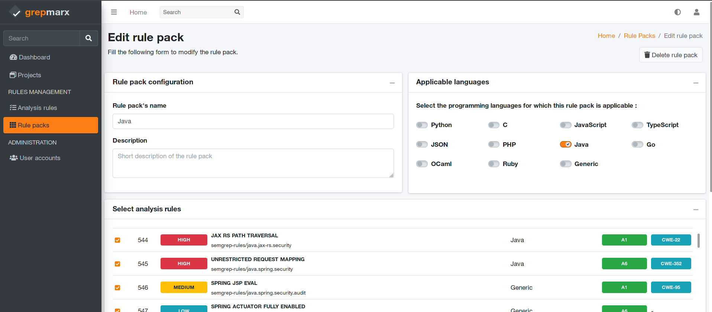

# Grepmarx - Application Security Platform

Grepmarx is a web application providing a single platform to quickly understand, analyze and identify vulnerabilities in possibly large and unknown code bases.

## Features

SAST (Static Analysis Security Testing) capabilities:
- Multiple languages support: C/C++, C#, Go, HTML, Java, Kotlin, JavaScript, TypeScript, OCaml, PHP, Python, Ruby, Bash, Rust, Scala, Solidity, Terraform, Swift
- Multiple frameworks support: Spring, Laravel, Symfony, Django, Flask, Node.js, jQuery, Express, Angular...
- 1600+ existing analysis rules
- Easily extend analysis rules using Semgrep syntax: https://semgrep.dev/editor 
- Manage rules in rule packs to tailor code scanning

SCA (Software Composition Analysis) capabilities:
- Multiple package-dependency formats support: NPM, Maven, Gradle, Composer, pip, Gopkg, Gem, Cargo, NuPkg, CSProj, PubSpec, Cabal, Mix, Conan, Clojure, Docker, GitHub Actions, Jenkins HPI, Kubernetes
- SBOM (Software Bill-of-Materials) generation (CycloneDX compliant)

Extra
- Analysis workbench designed to efficiently browse scan results
- Scan code that doesn't compile
- Comprehensive LOC (Lines of Code) counter
- Inspector: automatic application features discovery
- ... and a Dark Mode

## Screenshots

| Scan customization | Analysis workbench | Rule pack edition |
| ------ | ------ | ------ | 
|  |  |  |

## Execution

Grepmarx is provided with a configuration to be executed in [Docker](https://www.docker.com/) and [Gunicorn](https://gunicorn.org/).

#### [Docker](https://www.docker.com/) execution
---

Make sure you have docker-composer installed on the system, and the docker daemon is running.
The application can then be easily executed in a docker container. The steps:

> Get the code

```bash
$ git clone https://github.com/Orange-Cyberdefense/grepmarx.git
$ cd grepmarx
```

> Start the app in Docker

```bash
$ sudo docker-compose pull && sudo docker-compose build && sudo docker-compose up -d
```

Visit `http://localhost:5000` in your browser. The app should be up & running.


#### [Gunicorn](https://gunicorn.org/)
---

Gunicorn 'Green Unicorn' is a Python WSGI HTTP Server for UNIX. A supervisor configuration file is provided to start it along with the required Celery worker (used for security scans queuing).

> Install using pip

```bash
$ pip install gunicorn supervisor
```
> Start the app using gunicorn binary

```bash
$ supervisord -c supervisord.conf
```

Visit `http://localhost:8001` in your browser. The app should be up & running.

## Build from sources

> Get the code

```bash
$ git clone https://github.com/Orange-Cyberdefense/grepmarx.git
$ cd grepmarx
```
> Install virtualenv modules
```bash
$ virtualenv env
$ source env/bin/activate
```

> Install Python modules
```bash
$ # SQLite Database (Development)
$ pip3 install -r requirements.txt
$ # OR with PostgreSQL connector (Production)
$ # pip install -r requirements-pgsql.txt
```

> Install additionnal requirements
```bash
# Dependency scan (cdxgen / depscan) requirements
$ sudo apt install npm openjdk-17-jdk maven gradle golang composer
$ sudo npm install -g @cyclonedx/cdxgen
$ pip install appthreat-depscan
```

> A Redis server is required to queue security scans. Install the `redis` package with your favorite distro package manager, then:

```bash
$ redis-server
```

> Set the FLASK_APP environment variable
```bash
$ export FLASK_APP=run.py
$ # Set up the DEBUG environment
$ # export FLASK_ENV=development
```

> Start the celery worker process
```bash
$ celery -A app.celery_worker.celery worker --pool=prefork --loglevel=info --detach
```

> Start the application (development mode)
```bash
$ # --host=0.0.0.0 - expose the app on all network interfaces (default 127.0.0.1)
$ # --port=5000    - specify the app port (default 5000)  
$ flask run --host=0.0.0.0 --port=5000
```

> Access grepmarx in browser: http://127.0.0.1:5000/

## Credits & Links

- The web application dashboard is based on [AdminLTE Flask](https://github.com/app-generator/flask-dashboard-adminlte)
- SAST code scanning is powered by the [semgrep](https://semgrep.dev/) engine
- SBOM generation is done with the great [CycloneDX cdxgen](https://github.com/CycloneDX/cdxgen), and SCA is performed using the awesome [AppThreat dep-scan](https://github.com/AppThreat/dep-scan)
- LOC counting is handled by [scc](https://github.com/boyter/scc)
- Features discovery is done using A[pplication Inspector](https://github.com/microsoft/ApplicationInspector)

<br />

---
Grepmarx - Provided by **[Orange Cyberdefense](https://orangecyberdefense.com)**.
